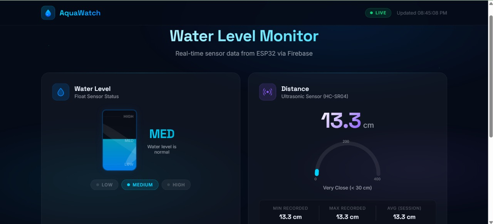
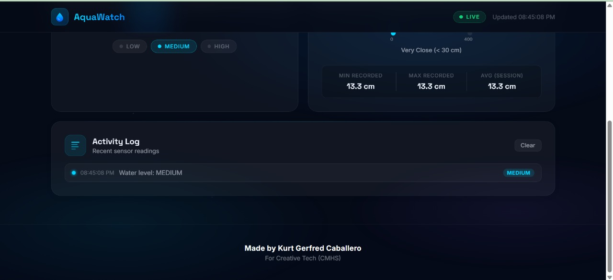
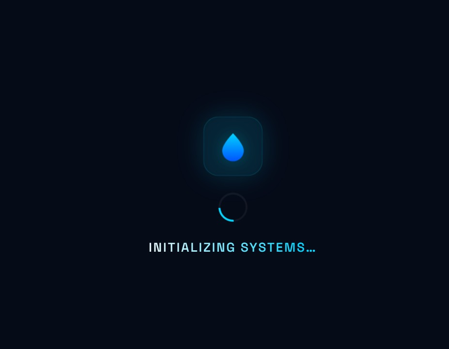

# 🌊 AquaWatch — Real-time Water Level Monitoring System

[](https://firebase.google.com/)
[](https://www.espressif.com/en/products/socs/esp32)
[](https://developer.mozilla.org/en-US/docs/Web/JavaScript)

AquaWatch is a high-performance, real-time web dashboard designed to monitor water levels remotely using IoT technology. Powered by an **ESP32** microcontroller and **Firebase Realtime Database**, this system provides sub-second latency updates, historical logging, and professional-grade data visualization.

---

## 📸 Media Gallery

| Dashboard Overview | Distance Monitoring | Mobile Experience |
|:---:|:---:|:---:|
|  |  |  |

---

## 🚀 Key Features

- **Real-time Synchronization**: Instant data updates across all connected clients using Firebase RTDB.
- **Dynamic Visualizations**: 
    - **Animated Tank**: A fluid SVG-based tank visualization that changes height and color based on the water level (Low, Medium, High).
    - **Arc Gauge**: A custom-built SVG circular gauge for precise ultrasonic distance readings (0–400cm).
- **Session Intelligence**: Automatically tracks minimum, maximum, and average readings during each session.
- **Activity Logging**: A live-updating historical log that records every sensor change with precise timestamps.
- **Responsive Design**: A premium, "glassmorphic" interface that works seamlessly on both desktop and mobile devices.
- **Connection Diagnostics**: Real-time heartbeat monitoring to detect when the sensor or web app goes offline.

---

## 🛠️ Tech Stack & Hardware

### Software
- **Frontend**: HTML5, CSS3 (Vanilla), ES6+ JavaScript.
- **Backend-as-a-Service**: Firebase Realtime Database.
- **Hosting**: Firebase Hosting.

### Hardware
- **Processor**: ESP32 (Wi-Fi enabled).
- **Primary Sensor**: HC-SR04 Ultrasonic Distance Sensor.
- **Secondary Sensor**: Float Switch (for ternary level state).

---

## 🧠 Technical Challenges & "The Engineer's Approach"

As a 14-year-old developer, I don't just build things—I solve problems that usually require advanced engineering knowledge. Here are two major challenges I encountered during development and how I engineered custom solutions for them:

### 1. The "Heavy Library" Dilemma
**Problem**: Most ready-made gauge libraries (like Chart.js or D3) are heavy, increasing page load times, and often don't match the modern, sleek aesthetic I wanted for AquaWatch.

**Solution**: I decided to build my own visualizations from scratch using **SVG and CSS Variables**. 
- I used the `stroke-dashoffset` property to calculate the gauge's arc position mathematically: `ARC_LENGTH - (percentage * ARC_LENGTH)`.
- This resulted in a **90% reduction in visualization-related JS weight** while allowing for total control over animations and gradients.

### 2. UI Flicker from Rapid Data Streams
**Problem**: During testing, the HC-SR04 sensor sometimes provided slightly fluctuating readings (e.g., 20.3cm then 20.4cm every millisecond). This caused the UI to flicker or the "Activity Log" to become cluttered with redundant entries.

**Solution**: I implemented a **Logic-Based Filtering System** in `app.js`:
- **Throttled Updates**: Applied CSS transitions (`cubic-bezier(0.4, 0, 0.2, 1)`) to the tank and gauge to "smooth out" physical sensor noise visually.
- **State Change Guard**: Programmed the Activity Log to only generate a new entry if the *category* (Low, Medium, High) changed, rather than for every minor centimeter fluctuation. This keeps the log readable and professional.

---

## 🔧 Installation & Setup

1. **Clone the repository**:
   ```bash
   git clone https://github.com/KCap-design/Web-Based-Water-Level-Monitoring.git
   ```
2. **Setup Firebase**:
   - Create a project at [Firebase Console](https://console.firebase.google.com/).
   - Enable **Realtime Database**.
   - Copy your config into `public/app.js`.
3. **Deploy Hardware**:
   - Flash your ESP32 with the corresponding Arduino/ESP-IDF code.
   - Ensure the database paths `/Water_level` and `/Ultrasonic` match the web app references.

---

## 👨‍💻 About the Author

Hi, I'm **Kurt Gerfred Caballero**. I'm a 14-year-old developer passionate about IoT, Full-stack development, and creating solutions for real-world problems. AquaWatch is part of my journey to bridge the gap between hardware and software, creating tools that are both functional and visually stunning.

---

*Made with ❤️ for Creative Tech (CMHS)*
